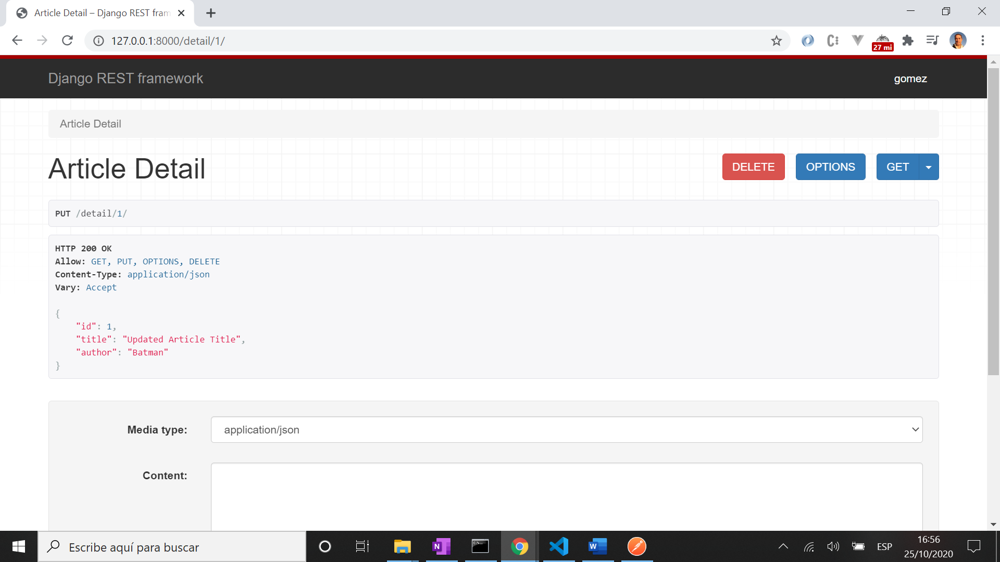

# :zap: Python-Flask PostgreSQL Heroku

* A RESTful API built using the Django framework

## :page_facing_up: Table of contents

* [:zap: Python-Flask PostgreSQL Heroku](#zap-python-flask-postgresql-heroku)
	* [:page_facing_up: Table of contents](#page_facing_up-table-of-contents)
	* [:books: General info](#books-general-info)
	* [:camera: Screenshots](#camera-screenshots)
	* [:signal_strength: Technologies](#signal_strength-technologies)
	* [:floppy_disk: Setup](#floppy_disk-setup)
	* [:computer: Code Examples](#computer-code-examples)
	* [:cool: Features](#cool-features)
	* [:clipboard: Status & To-do list](#clipboard-status--to-do-list)
	* [:clap: Inspiration](#clap-inspiration)
	* [:envelope: Contact](#envelope-contact)

## :books: General info

* Django framework: tba
* [Python Models](https://docs.djangoproject.com/en/dev/topics/db/models/) used as the source of information about data
* [Django ModelSerialisers](https://www.django-rest-framework.org/tutorial/1-serialization/) REST framework includes both Serializer classes, and ModelSerializer classes.

## :camera: Screenshots



## :signal_strength: Technologies

* [Python v3](https://www.python.org/) programming language
* [Django v3](https://www.djangoproject.com/) web framework
* [Django Rest Framework v3](https://www.django-rest-framework.org/) powerful and flexible toolkit for building Web APIs

## :floppy_disk: Setup

* [Install Python](https://docs.python-guide.org/starting/installation/)
* [Install pip](https://docs.python-guide.org/dev/virtualenvs/#installing-pipenv)
* [Install Django](https://docs.djangoproject.com/en/3.1/howto/windows/)
* Add code
* `python manage.py runserver` to run server on port 8000

## :computer: Code Examples

* code to tba

```python

```

## :cool: Features

* tba

## :clipboard: Status & To-do list

* Status: in work
* To-do: Complete code

## :clap: Inspiration

* [Parwiz Forogh: Django REST Framework Full Course For Beginners | Build REST API With Django](https://www.youtube.com/watch?v=B38aDwUpcFc)
* [Parwiz Blog: Django REST Framework Course for Beginners](https://codeloop.org/django-rest-framework-course-for-beginners/) but beware of popups
* [Data to Fish: How to Upgrade PIP in Windows](https://datatofish.com/upgrade-pip/)
* [The Hitchhiker’s Guide to Python!](https://docs.python-guide.org/)

## :envelope: Contact

* Repo created by [ABateman](https://www.andrewbateman.org) - you are welcome to [send me a message](https://andrewbateman.org/contact)
