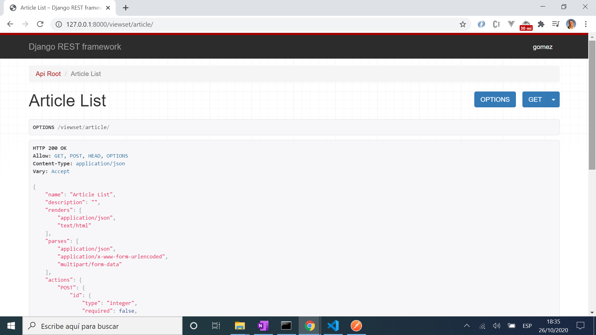

# :zap: Python Django API

* A RESTful API built using Python and the Django framework
* **Note:** to open web links in a new window use: _ctrl+click on link_


## :page_facing_up: Table of contents

* [:zap: Python Django API](#zap-python-django-api)
  * [:page_facing_up: Table of contents](#page_facing_up-table-of-contents)
  * [:books: General info](#books-general-info)
  * [:camera: Screenshots](#camera-screenshots)
  * [:signal_strength: Technologies](#signal_strength-technologies)
  * [:floppy_disk: Setup](#floppy_disk-setup)
  * [:computer: Code Examples](#computer-code-examples)
  * [:cool: Features](#cool-features)
  * [:clipboard: Status & To-do list](#clipboard-status--to-do-list)
  * [:clap: Inspiration](#clap-inspiration)
  * [:envelope: Contact](#envelope-contact)

## :books: General info

* Django framework: dynamic CRUD interface used, configured with admin models
* [Python Models](https://docs.djangoproject.com/en/dev/topics/db/models/) used as the source of information about data
* [Django ModelSerialisers](https://www.django-rest-framework.org/tutorial/1-serialization/) REST framework includes both Serializer classes, and ModelSerializer classes.
* [Django Generic View](https://www.tutorialspoint.com/django/django_generic_views.htm) classes used to save code.
* [Django REST framework Mixin](https://www.django-rest-framework.org/api-guide/generic-views/#mixins) classes used to provide basic view behaviour.
* [Django REST framework Authentication](https://www.django-rest-framework.org/api-guide/authentication/) token-based HTTP Authentication scheme used
* [Django REST framework Viewsets](https://www.django-rest-framework.org/tutorial/6-viewsets-and-routers/) used to allow the URL construction to be handled automatically

## :camera: Screenshots




## :signal_strength: Technologies

* [Python v3](https://www.python.org/) programming language
* [Django v3](https://www.djangoproject.com/) web framework
* [Django Rest Framework v3](https://www.django-rest-framework.org/) powerful and flexible toolkit for building Web APIs
* [Postman test API](https://www.postman.com/use-cases/api-testing-automation/) to send HTTP POST, PUT, GET and DELETE requests

## :floppy_disk: Setup

* [Install Python](https://docs.python-guide.org/starting/installation/)
* [Install pip](https://docs.python-guide.org/dev/virtualenvs/#installing-pipenv)
* [Install Django](https://docs.djangoproject.com/en/3.1/howto/windows/)
* Add code
* Enter `python manage.py runserver` to run server on port 8000

## :computer: Code Examples

* The ArticleViewSet class with the queryset and serializer_class attributes provided. The actions provided by the ModelViewSet class are .list(), .retrieve(), .create(), .update(), .partial_update(), and .destroy().

```python
class ArticleViewSet(viewsets.ModelViewSet):
    """
    A simple ViewSet for viewing all articles.
    """
    queryset = Article.objects.all()
    serializer_class = ArticleSerializer
```

## :cool: Features

* tba

## :clipboard: Status & To-do list

* Status: Mostly complete
* To-do: Add commenting and test some more

## :clap: Inspiration

* [Parwiz Forogh: Django REST Framework Full Course For Beginners | Build REST API With Django](https://www.youtube.com/watch?v=B38aDwUpcFc)
* [Parwiz Blog: Django REST Framework Course for Beginners](https://codeloop.org/django-rest-framework-course-for-beginners/) but beware of popups
* [Data to Fish: How to Upgrade PIP in Windows](https://datatofish.com/upgrade-pip/)
* [The Hitchhiker’s Guide to Python!](https://docs.python-guide.org/)

## :file_folder: License

* This project is licensed under the terms of the MIT license.

## :envelope: Contact

* Repo created by [ABateman](https://github.com/AndrewJBateman), email: gomezbateman@yahoo.com
